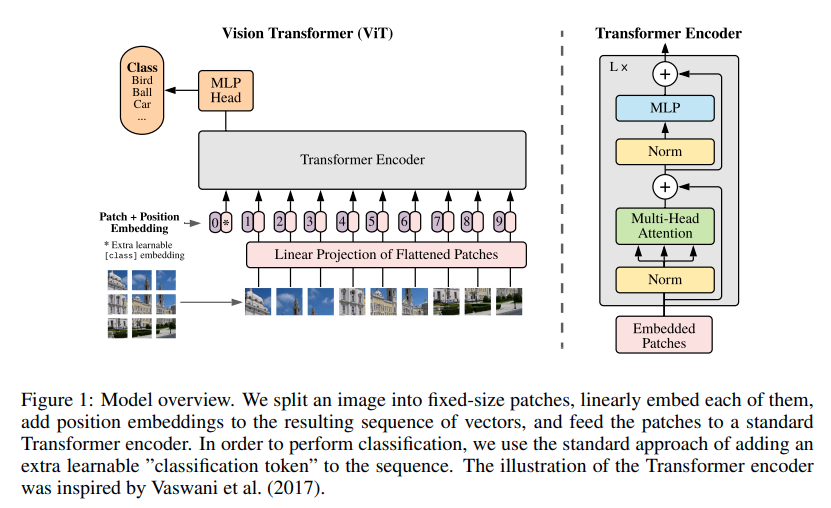

# Vision Transformer

</img>

## [Abstract](https://openreview.net/forum?id=YicbFdNTTy)
Abstract: While the Transformer architecture has become the de-facto standard for natural language processing tasks, its applications to computer vision remain limited. In vision, attention is either applied in conjunction with convolutional networks, or used to replace certain components of convolutional networks while keeping their overall structure in place. We show that this reliance on CNNs is not necessary and a pure transformer can perform very well on image classification tasks when applied directly to sequences of image patches. When pre-trained on large amounts of data and transferred to multiple recognition benchmarks (ImageNet, CIFAR-100, VTAB, etc), Vision Transformer attains excellent results compared to state-of-the-art convolutional networks while requiring substantially fewer computational resources to train.

Vision Transformer implemented using TF 2.0.

To run this model,just run `train_cifar.py

You need to download the cifar-100 dataset and put it in the same directory of train_cifar.py.The file can be download through google drive.
